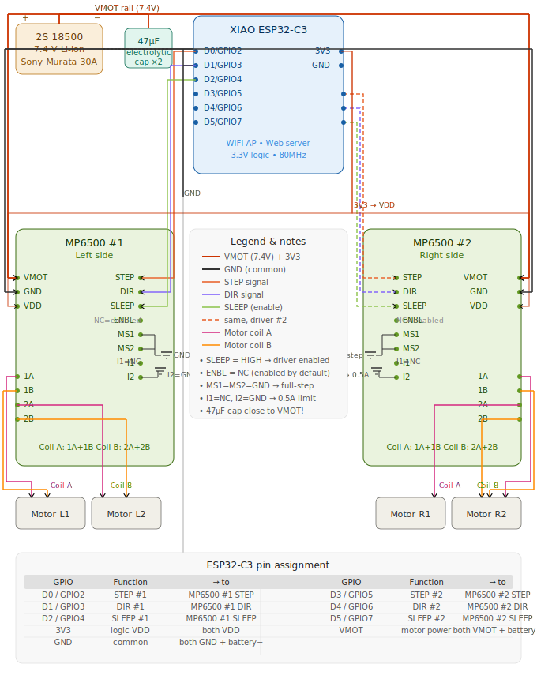

# MP6500 × ESP32-C3 — Wiring Diagram

A dual stepper-motor driver setup using two **MP6500** modules controlled by a **XIAO ESP32-C3** over WiFi. Power is supplied by a 2S Li-ion pack (7.4 V).

> If the SVG doesn't render in your client, the diagram is also available as a standalone file: [`wiring_diagram.svg`](wiring_diagram.svg).

---

## Components

| Block | Part | Specs |
|---|---|---|
| Power | 2S 18500 Li-ion (Sony Murata 30A) | 7.4 V nominal |
| Protection | 47 µF electrolytic cap × 2 | One close to VMOT on each driver |
| Controller | XIAO ESP32-C3 | 3.3 V logic, 80 MHz, WiFi AP + web server |
| Driver #1 | MP6500 (left side) | Drives motors L1, L2 |
| Driver #2 | MP6500 (right side) | Drives motors R1, R2 |
| Motors | 4 × stepper (~70 mA each) | Two per driver: coils A and B |

---

## ESP32-C3 pin assignment

| GPIO | Function | → To |
|---|---|---|
| **D0 / GPIO2** | STEP #1 | MP6500 #1 → STEP |
| **D1 / GPIO3** | DIR #1 | MP6500 #1 → DIR |
| **D2 / GPIO4** | SLEEP #1 | MP6500 #1 → SLEEP |
| **D3 / GPIO5** | STEP #2 | MP6500 #2 → STEP |
| **D4 / GPIO6** | DIR #2 | MP6500 #2 → DIR |
| **D5 / GPIO7** | SLEEP #2 | MP6500 #2 → SLEEP |
| **3V3** | Logic VDD | Both MP6500 → VDD |
| **GND** | Common ground | Both MP6500 GND + battery − |
| **VMOT (rail)** | Motor power | Both MP6500 VMOT + battery + |

---

## Power rails

- **VMOT rail (7.4 V)** — battery + → 47 µF cap → VMOT of both drivers.
  Place the capacitor **as close as possible to VMOT** on each MP6500.
- **3V3** — from the ESP32-C3 to VDD of both drivers (logic power).
- **GND** — common: battery −, ESP32-C3 GND, both MP6500 GND.

---

## Static connections on each MP6500

| Pin | State | Purpose |
|---|---|---|
| `ENBL` | NC (not connected) | Driver enabled by default |
| `SLEEP` | HIGH (controlled) | Driven by ESP32-C3 GPIO, enables the driver |
| `MS1` | GND | `MS1 = MS2 = GND` → **full-step** mode |
| `MS2` | GND | (see above) |
| `I1` | NC | — |
| `I2` | GND | Current limit set to **0.5 A** (plenty of headroom for 70 mA motors) |

---

## Motor wiring

Each MP6500 drives two motors via two coils:

- **Coil A** = outputs `1A` + `1B`
- **Coil B** = outputs `2A` + `2B`

| Driver | Coil A → | Coil B → |
|---|---|---|
| MP6500 #1 (left) | Motor L1 | Motor L2 |
| MP6500 #2 (right) | Motor R1 | Motor R2 |

---

## Wire color legend

| Color | Signal |
|---|---|
| 🔴 Red | VMOT (7.4 V) and 3V3 |
| ⚫ Black | GND (common) |
| 🟠 Orange | STEP |
| 🟣 Purple | DIR |
| 🟢 Green | SLEEP (enable) |
| Orange dashed | Same as above, but for driver #2 |
| 🩷 Magenta | Motor coil A |
| 🟧 Dark orange | Motor coil B |

---

## Important notes

> ⚠️ **The 47 µF capacitor MUST sit physically close to VMOT on each driver.** Switching coil currents otherwise create voltage spikes that can destroy the MP6500.

- `SLEEP = HIGH` enables the driver. Hold SLEEP LOW on boot until the ESP32-C3 has finished initialization.
- `ENBL` is left floating on purpose: this input has an internal pull-down on the MP6500 module, so the driver is enabled by default.
- `I2 = GND` sets the current limit to **0.5 A** — far above the 70 mA needed by the small motors, so heating is negligible.
- All grounds (battery −, ESP GND, both MP6500 GND) must meet at a **single star point** — no ground loops.
