# KAPO Ta4ka — Wiring Diagram

A mobile robot built around a **XIAO ESP32-C3** main controller, two **DRI0044** motor drivers (4 stepper motors), an **AtomS3R M12** with OV3660 camera, an **ESP32-CAM** as a QR reader, plus I²C sensors (TCS34725 color, VL53L0X ToF).

Powered by a 2S 21700 Li-ion pack (7.4 V), with a step-down DC-DC providing 5 V for the camera boards and sensors.



> If the SVG doesn't render in your client, the diagram is also available as a standalone file: [`kapo_tacka_wiring_diagram.svg`](kapo_tacka_wiring_diagram.svg).

---

## Components

| Block | Part | Role |
|---|---|---|
| Power | 2S 21700 Li-ion pack | 7.4 V · 3600 mAh · 30 A |
| Regulator | Step-down DC-DC | 7.4 V → 5 V |
| Main MCU | XIAO ESP32-C3 | WiFi AP + WebSocket server, motor + sensor control |
| Motor driver #1 | DRI0044 (left) | Drives motors L1, L2 |
| Motor driver #2 | DRI0044 (right) | Drives motors R1, R2 |
| Motors ×4 | Stepper | L1/L2 left front/rear, R1/R2 right front/rear |
| Color sensor | TCS34725 | I²C 0x29, on main bus |
| Front camera | AtomS3R M12 (OV3660) | WiFi STA, streams `/stream`, hosts VL53L0X on PORT A |
| Distance sensor | VL53L0X (ToF) | Connected to AtomS3R PORT A I²C |
| QR reader | ESP32-CAM (AI-Thinker) | WiFi STA, ceiling-facing camera, posts `/qr` |
| UI | Browser (phone / PC) | WebSocket + MJPEG stream |
| Decoupling | 47 µF cap × 2 | One per DRI0044, close to VM |

---

## XIAO ESP32-C3 pin assignment

| GPIO | Function | → To |
|---|---|---|
| **GPIO2** | L_DIR | DRI0044 #1 → DIR1 |
| **GPIO3** | L_STEP | DRI0044 #1 → PWM1 |
| **GPIO4** | L_EN | DRI0044 #1 → enable |
| **GPIO5** | R_DIR | DRI0044 #2 → DIR1 |
| **GPIO6** | R_STEP | DRI0044 #2 → PWM1 |
| **GPIO7** | R_EN | DRI0044 #2 → enable |
| **GPIO8** | SDA | I²C bus (TCS34725) |
| **GPIO9** | SCL | I²C bus (TCS34725) |
| **GPIO20** | VIN_EN | Power-rail enable #1 |
| **GPIO21** | VIN_EN2 | Power-rail enable #2 |
| **5V / 3V3 / GND** | Power out | DRI0044 VCC, sensors |

---

## Motor wiring

Each DRI0044 drives two stepper motors via the `M1A/M1B/M2A/M2B` outputs.

| Driver | Motor 1 | Motor 2 |
|---|---|---|
| DRI0044 #1 (left) | Motor L1 — left front | Motor L2 — left rear |
| DRI0044 #2 (right) | Motor R1 — right front | Motor R2 — right rear |

Driver supply: `VM = 7.4 V` (from battery), `VCC = 3.3 V` (logic, from XIAO).

---

## I²C buses

The system has **two independent I²C buses**:

### Main bus (on XIAO ESP32-C3)
- **SDA** → GPIO8
- **SCL** → GPIO9
- Devices: **TCS34725** color sensor (address `0x29`)

### AtomS3R PORT A bus
- **SDA** → PORT A G1
- **SCL** → PORT A G2
- Power: 5 V · GND from PORT A
- Devices: **VL53L0X** time-of-flight distance sensor

Keeping the ToF sensor on the AtomS3R bus offloads I²C traffic from the main MCU and keeps the sensor physically close to the front-facing camera.

---

## WiFi topology

```
                 ┌─────────────────────────┐
                 │   XIAO ESP32-C3 (AP)    │
                 │   WiFi access point     │
                 │   WebSocket server      │
                 └────┬───────────┬────────┘
                      │           │
              WiFi STA│           │WiFi STA
                      │           │
       ┌──────────────▼──┐   ┌────▼──────────┐
       │ AtomS3R M12     │   │  ESP32-CAM    │
       │ POST /sensor    │   │  POST /qr     │
       │ Serves /stream  │   │  (QR reader)  │
       └─────────────────┘   └───────────────┘
                      │           │
                      └─────┬─────┘
                            │
                       ┌────▼──────────┐
                       │  Browser      │
                       │  (phone / PC) │
                       │  WS + MJPEG   │
                       └───────────────┘
```

- **XIAO ESP32-C3** runs the access point and WebSocket server.
- **AtomS3R** and **ESP32-CAM** connect as stations and POST sensor / QR data.
- The browser opens the WebSocket on the XIAO and pulls the MJPEG stream directly from the AtomS3R (`/stream`).

---

## HTTP endpoints

| Endpoint | Hosted by | Purpose |
|---|---|---|
| `/stream` | AtomS3R M12 | MJPEG video stream from OV3660 |
| `POST /sensor` | XIAO ESP32-C3 | AtomS3R uploads VL53L0X readings |
| `POST /qr` | XIAO ESP32-C3 | ESP32-CAM uploads decoded QR codes |
| `ws://…/` | XIAO ESP32-C3 | WebSocket for browser control + telemetry |

---

## Wire color legend

| Color | Signal |
|---|---|
| 🔴 Red, solid | 7.4 V VMOT / battery |
| 🟠 Orange | 5 V regulated |
| 🟣 Purple | GPIO signal |
| 🔵 Blue | WiFi / I²C data |
| 🟠 Dashed orange | AtomS3R connections |
| 🟢 Dashed green | ESP32-CAM WiFi |

---

## Important notes

> ⚠️ **Place a 47 µF cap right next to VM on each DRI0044.** Stepper coils switching at full current generate spikes that will eventually kill the driver if there's no local decoupling.

- The DC-DC supplies **5 V** to the AtomS3R, ESP32-CAM, and sensors. The XIAO ESP32-C3 produces its own **3.3 V** rail from its USB / 5 V input, which feeds the DRI0044 `VCC` (logic) and the TCS34725.
- `VIN_EN` / `VIN_EN2` (GPIO20, GPIO21) let the XIAO power-gate the camera boards independently — useful for clean restarts without unplugging anything.
- All grounds — battery −, DC-DC GND, XIAO GND, both DRI0044 GND, both camera modules, all sensors — must meet at a **single star point**. No ground loops.
- The two cameras have different jobs: **AtomS3R** looks forward (driving / line-of-sight), **ESP32-CAM** looks up at the ceiling (QR-based localization).
